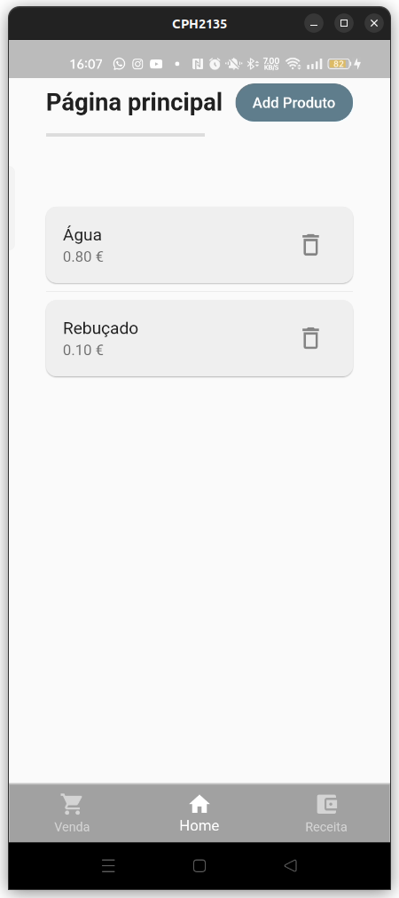
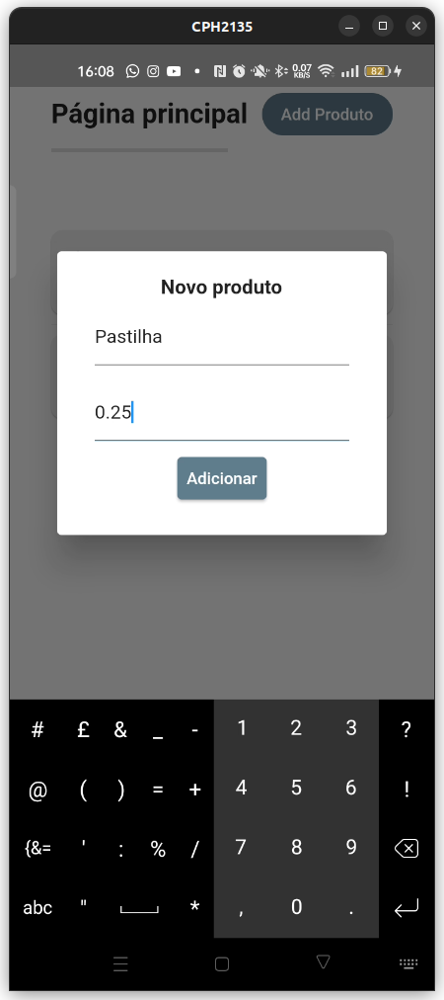
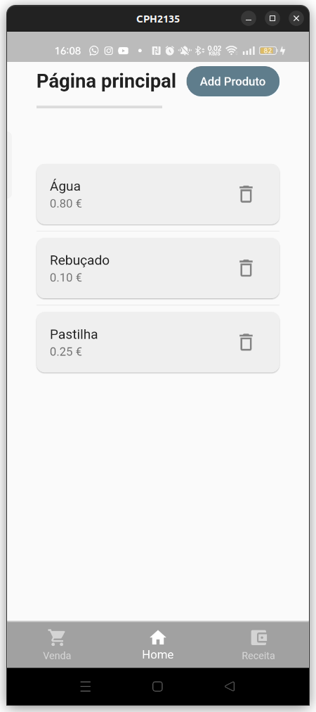
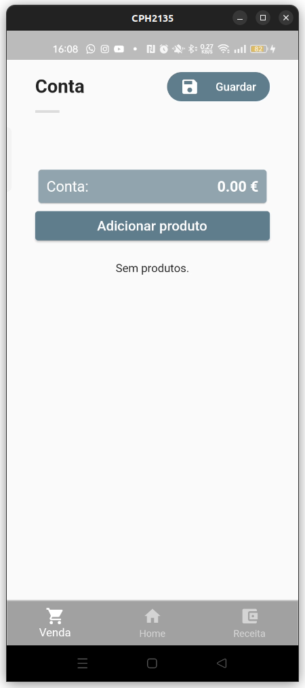
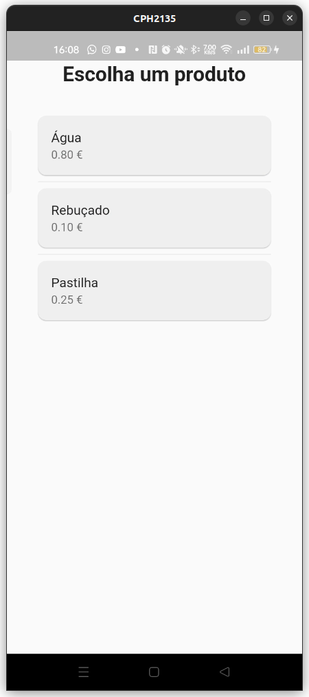
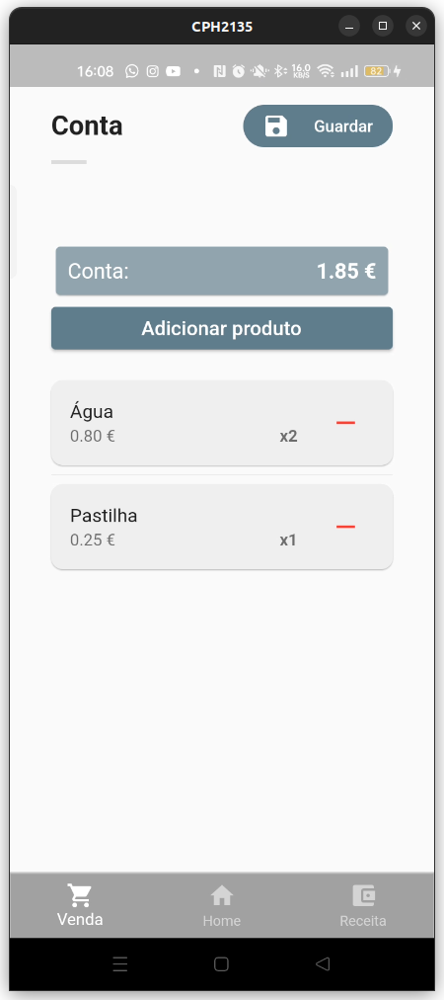
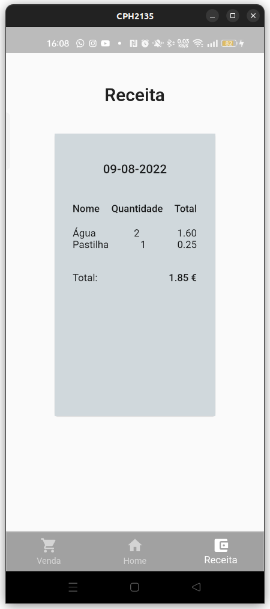

# Skopos

Skopos app.

## Getting Started

This app was created to be used in a bar, as a solution to the current setting (everything was being written ono paper).

## How to use

The  is meant to show all the products available.
You are also able to add new products by pressing "Add Produto", showing 
, which will show the product after saved ().

With products on the database you can now use the . 
To use this page, you just have to click on "Adicionar Produto" to have that product on your cart (which will show you ).
You just need to click the "Guardar" button to save the cart with products ().

When you have saved, at least, 1 cart you'll be able to see all the expenses at the receipt page, 
which will show all the sold products, quantity, how much was that product and how much was money 
was sold that day (). 